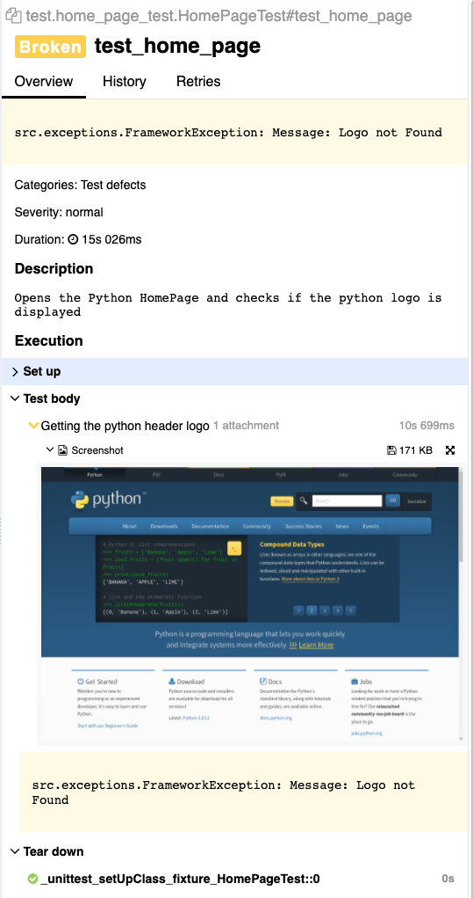

# Python-Selenium-Framework

### :confused: What is it?
This framework provides a Selenium automation bootstrap project using:
- Selenium Grid 4
- Page-Object-Model Pattern
- Pytest
- Allure Reporting

### :robot: Selenium Grid 4
This project is currently built for the use of a RemoteWebdriver so that it is easy to adapt to a production ready environment for cloud testing such as SauceLabs, Browserstack and so on.

You can spin up the grid by running:

`docker-compose up -d`

This spins up 3 containers:
1. Selenium-Hub
2. Chrome Node
3. Chrome Video (for video recording)

### :muscle: How to run the tests
To run the tests just run:
`pytest test --alluredir=results`

"Results" will be the directory allure will create and post the results to.

### :bar_chart: Reporting
Reporting is done via allure.
To check the results of the tests:
`allure serve results`

A custom exception _FrameworkException_ will attach a screenshot to the allure report in the specific step where it failed.
Allure is able to attach the screenshot to the proper step only if you use _@allure.step()_ in the page object. If not, 
you'll have the screenshot but not attached to the correct step.

#### Example:

